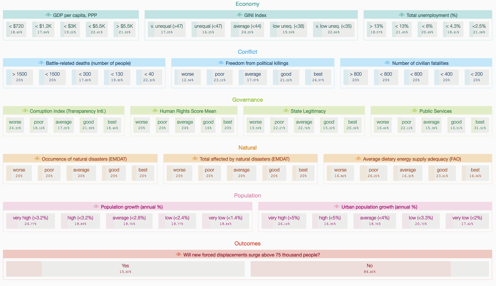
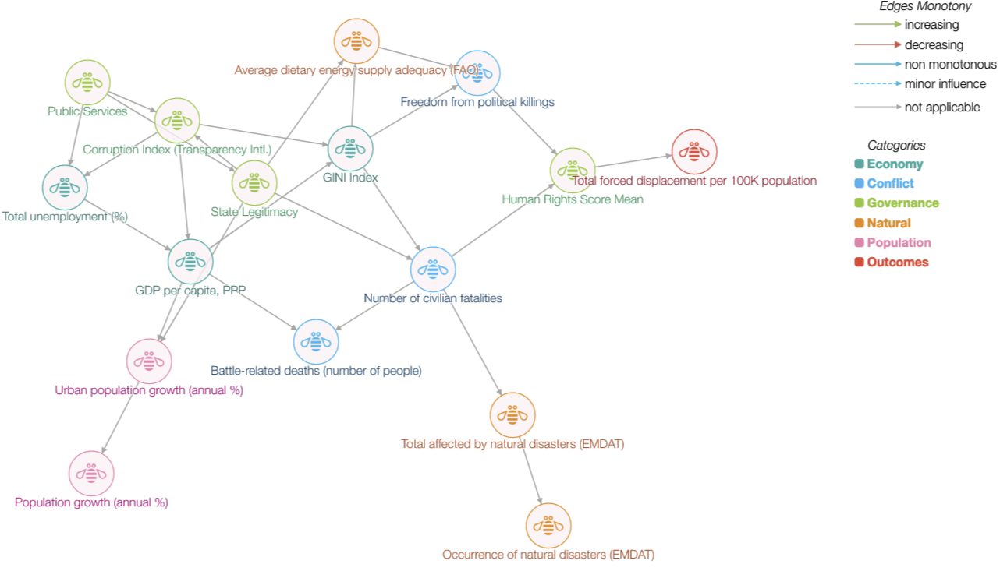

At NeurIPS 2021 this year, Pierpaolo Tomassi and I have a demonstrator that brings together a few ideas on surrogates, bayesian networks, and model understanding. The [system](https://prosp-exp.eu-gb.mybluemix.net/ui/explorer/index.html) (while its still up!) shows one view on *prospective* explanations, one when requires some effort from users to build a mental model of ML model by probing interactively. 

The system is designed for regression and classification tasks with structured data. Prospective explanations are aimed at showing how models work by highlighting likely changes in model outcomes under changes in input ([Shneiderman 2020](https://dl.acm.org/doi/10.1145/3419764)). This in contrast to most post-hoc explanability methods, that aim to provide a justification for a decision retrospectively. A desired property of explanations is to help with creating the right mental model of an AI system. The right mental model leads to greater trust ([Bansal et al., 2019](https://doi.org/10.1609/aaai.v33i01.33012429 )). Interactive systems that allow for exploration have been shown to improve user comprehension ([Chen et al., 2019](https://dl.acm.org/doi/10.1145/3290605.3300789)) albeit being more time consuming. 

Our system is designed to provide fast estimates of changes in outcomes for any arbitrary exploratory query from users. Such queries are typical partial, i.e. involve only a selected number of features, the outcomes labels are shown therefore as likelihoods. Repeated queries can therefore indicate which aspects of the feature space are more likely to influence the target variable.

To achieve fast interactive exploration, we build a surrogate Bayesian network model. A surrogate here implies the use of model labels instead of ground truth labels to represent model behaviour. Bayesian network models are stored as directed acyclic graphs where links represent dependence between variables. This graph representation can be learnt directly from the data through a structure learning task, or be provided externally and only conditional probabilities estimated from the data. Bayesian networks are efficient in storing the joint distribution over feature sets and allow for fast inference over arbitrary queries. 

Specifically, we seek to explain a model $f$ that maps an input vector $\mathbf{x}_i$ to an output $y_i$. Consider a validation dataset $D$, a set of $(\mathbf{x}_i, y_i)$ observations for $i=1,...,n$. For this validation data, we generate a set of labels $\hat{y}_i = f(\mathbf{x}_i)$. A structure learning algorithm is used, treating both features $\mathbf{x}_i$ and labels $\hat{y}_i$ as random variables to learn a graph $G(V, E)$ and associated probability tables. During inference, users provide arbitrary feature values, and the marginal distribution of the target class estimated using the formula

$$P(x_1 = a_1, x_2 = a_2, ..., x_k=a_k,y=y_1) = \prod_{v=1}^{n} P(x_v=a_v| x_j = a_j \, j\in pa(v))$$

where $pa(v)$ denotes all parents of a node $v$ in $G$. While inference in Bayesian networks is NP-Hard, assumptions on the structure of $G$ admits fast inference in practice. We experimented with four strategies in particular. First, the network structure was defined *a priori* from expert opinion leading to a lower node degree. Second, we experimented with limiting the number of parents for each node. Third, we learnt the structure on a limited set of important features as determined by feature important scores. Lastly, the network is training on a subset of features used in $f$. In our experiments, these approaches did not degrade performance of the surrogate model substantively.

The main advantages of our approach are that (a) inference in most practical cases is very fast and supports real-time feedback allowing for interactivity, (b) inference can be done with partial information on features, and (c) any indirect effects are also considered in estimating target class distributions. Regression models involve an additional consideration. The target variable $\hat{y}_i$ is discretized before learning the structure. This is necessary to avoid the difficulty of perceiving changes in continuous probability distributions.

The system provides two views. The first, a feature board showing all relevant features with clickable values that formulate queries. These are clustered by theme. Any selection results in updates to marginal distributions for all other variables. 

The second view is the learnt Bayesian network itself.

We have deployed the system for several health and social care domains. Here we demonstrate it for a humanitarian application that deals with forced displacement. We explain two model classes for two tasks, one classification and one regression. Forced displacement refers to the involuntary movement of people away from their homes. This sector is highly complex, and a wide range of factors can potentially influence the onset and severity of displacement crisis. Responding organizations have to plan under high uncertainty on the type of humanitarian need. Previous user-studies for this sector has uncovered the need to surface this uncertainty ([Andres et al., 2020](https://dl.acm.org/doi/abs/10.1145/3334480.3382903)) which is both aleatory (uncertainty due to things that cannot be predicted) and epistemic (uncertainty due to missing information).

While the regression task is to forecast volume of displaced persons, the classification task seeks to classify if the volume is likely to exceed a "crisis" threshold (the UNHCR informally deems a crisis when displacement volumes are in excess of 75,000 persons). For each task, prospective explanations of two models each that are training on data from a period from 1980 through 2015. Data after 2015 is used for the validation set $D$. For classification, a logistic regression with validation accuracy (acc) 97.2% and a gradient boosted classifier (acc: 98.03%) are shown. Both models exhibit poor precision for the minority class. Compared to ground truth reference, the models are less likely to predict a crisis. For regression we show a linear regression (MAE: 2086.03) and a gradient boosted regressor (MAE: 1155.69). For the latter, baseline performance (overestimates for 100-5000 ranges, and underestimates for $>5000$) can be seen. When uses toggle the human rights dimension to `worse', predictions for >5000 better match ground truth labels. While this estimator is highly non-linear,  the impact of influencing factors can be understood by interacting with features values and visual representation of outcome marginals.

